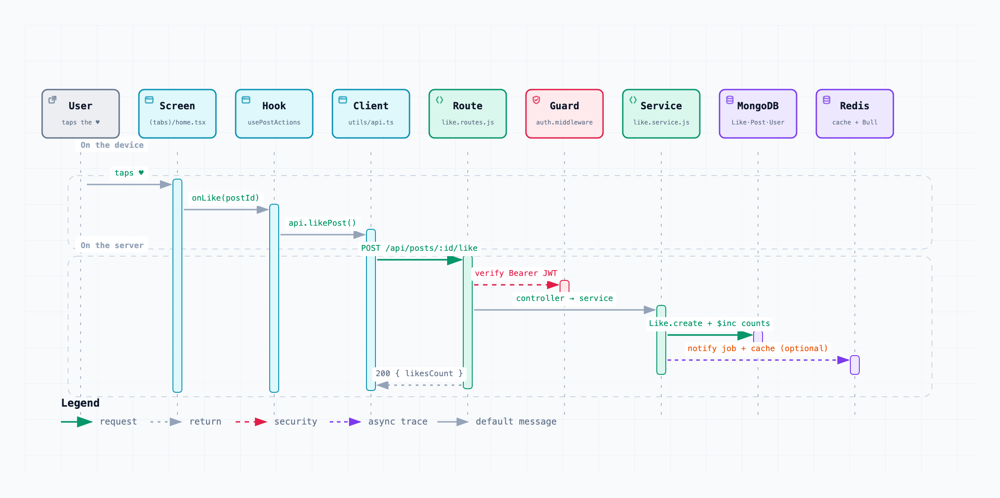
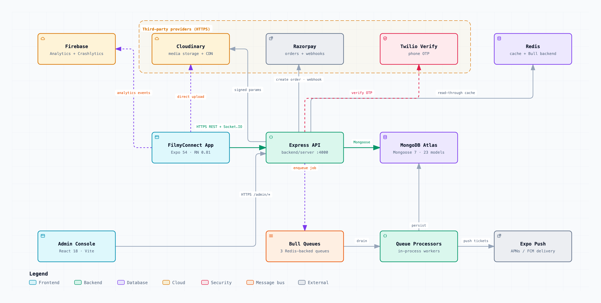

# FilmyConnect

A social platform for creative professionals in film — actors, directors, writers, and technical crew.
Users verify their identity, publish rich media (video, audio, image, script, text), build public or
private networks, engage through likes/comments/shares, and discover work through a personalised feed.

Three deployable pieces live in this repository:

| Piece | What it is | Lives in |
| :--- | :--- | :--- |
| **Mobile app** | Expo / React Native client for iOS and Android | [app/](app/) |
| **API server** | Express + Socket.IO backend, MongoDB, Bull queues | [backend/](backend/) |
| **Admin console** | React + Vite back-office dashboard | [admin/](admin/) |

---

# Start here — one request, end to end

New to the codebase? Read this one diagram and you can find anything.

It follows a single user action — tapping ♥ on a post — from the finger on the screen all the way to
the database and back. **Every lane is labelled with the real file that does that step.** Almost every
feature in this app repeats exactly this shape, so once you can follow this, you can follow all of it.

<picture>
  <source media="(prefers-color-scheme: dark)" srcset="docs/architecture/request-lifecycle-dark.png">
  
</picture>

### The rule the whole codebase follows

```
DEVICE     screen  →  hook  →  utils/api.ts        screens never call fetch() themselves
             ↓
SERVER     route  →  middleware  →  controller  →  service  →  model
                                    (thin)        (all logic)
```

Adding a feature means creating one file at each layer and following the naming convention. Finding a
feature means walking the same chain in reverse.

### The three entry points

| You want to trace… | Open this first |
| :--- | :--- |
| **The app** | [app/app/_layout.tsx](app/app/_layout.tsx) — providers, routing, notification wiring |
| **The API** | [backend/server/src/app.js](backend/server/src/app.js) — the entire route table in one file |
| **The admin console** | [admin/src/App.tsx](admin/src/App.tsx) — routes and layout |

The API's real boot sequence is [server.js](backend/server/src/server.js), not `app.js`: it creates
the HTTP server, attaches Socket.IO to that same server, connects Mongo and Redis, and loads the queue
processors — all in one process.

---

# Where to find things

### Mobile app — [app/](app/)

| Folder | What lives there |
| :--- | :--- |
| [app/app/](app/app/) | Screens. File-based routing via expo-router, so the path *is* the URL. `(tabs)/` is the main nav. |
| [app/components/](app/components/) | Presentational components, grouped by feature. They take props and render; no fetching. |
| [app/hooks/](app/hooks/) | Where feature logic lives — 40 hooks like `useFeed`, `usePostActions`, `useFollow`. **Start here when changing behaviour.** |
| [app/contexts/](app/contexts/) | Cross-app state: Auth, Socket, Notification, Message, Media, Theme. |
| [app/utils/api.ts](app/utils/api.ts) | Every HTTP call in the app, one function per endpoint. |
| [app/types/](app/types/) | Shared TypeScript types. |

### API server — [backend/server/src/](backend/server/src/)

| Folder | What lives there |
| :--- | :--- |
| [app.js](backend/server/src/app.js) | Middleware chain and the full route table. Best map of the API surface. |
| [server.js](backend/server/src/server.js) | Boot: HTTP server, Socket.IO, Mongo, Redis, queue processors. |
| [routes/](backend/server/src/routes/) | URL → controller. 30 modules, one per resource. |
| [middlewares/](backend/server/src/middlewares/) | `auth`, `adminAuth`, `requireRole`, `validate`, rate limiters, logging, errors. |
| [controllers/](backend/server/src/controllers/) | Thin. Read the request, call a service, shape the response. |
| [services/](backend/server/src/services/) | **All business logic.** 20 modules — this is where real work happens. |
| [models/](backend/server/src/models/) | 23 Mongoose schemas. |
| [sockets/](backend/server/src/sockets/) | Realtime chat and community handlers. |
| [workers/processors.js](backend/server/src/workers/processors.js) | Background jobs: feed updates, notifications, subscription expiry. |
| [config/](backend/server/src/config/) | db, redis, cloudinary, twilio, logger. |
| [utils/](backend/server/src/utils/) | httpError, token, response, messageCrypto, socketStore. |
| [scripts/](backend/scripts/) | Database seeders and cleanup. |

### Admin console — [admin/src/](admin/src/)

| Folder | What lives there |
| :--- | :--- |
| [pages/](admin/src/pages/) | One file per admin screen. |
| [routes/](admin/src/routes/) | Route definitions. |
| [services/api.ts](admin/src/services/api.ts) | axios client and every admin endpoint. |
| [components/](admin/src/components/) | shadcn/ui-based building blocks. |

### Common tasks

| Task | Where to go |
| :--- | :--- |
| Add an API endpoint | `routes/` → `controllers/` → `services/` → `models/` |
| Change what a screen shows | `app/app/<screen>.tsx`, then its hook in `app/hooks/` |
| Change how something is saved | the matching `services/*.service.js` |
| Add a background job | `services/queue.service.js` + `workers/processors.js` |
| Change auth or permissions | `middlewares/auth.middleware.js`, `requireRole.middleware.js` |
| Add a push notification | `services/notification.service.js` |
| Debug a realtime issue | `sockets/`, plus `contexts/SocketContext.tsx` on the app side |

---

# System architecture

The view above follows one request. This one shows every moving part at once, and which external
services the system depends on.

<picture>
  <source media="(prefers-color-scheme: dark)" srcset="docs/architecture/architecture-dark.png">
  
</picture>

Both diagrams also exist as **interactive pages** —
[request-lifecycle.html](docs/architecture/request-lifecycle.html) and
[architecture.html](docs/architecture/architecture.html). GitHub will not render them in the browser,
so download a file and open it locally; each is fully self-contained, no server or network needed.
In the viewer: `?` for a guide, `/` to search, `R` to trace a route, `P` to play the guided tours,
`T` for theme, `E` to export.

### Five things the diagrams will not tell you

1. **It is one Node process, not a fleet.** [server.js](backend/server/src/server.js) builds the HTTP
   server from the Express app, attaches Socket.IO to that same server, then `require`s the queue
   processors into the same process. There is no separate worker service to deploy.

2. **Writes go to MongoDB first, synchronously.** Despite the write-through caching described in
   [PROJECT_SPECIFICATION.md](docs/PROJECT_SPECIFICATION.md),
   [like.service.js](backend/server/src/services/like.service.js) creates the document, increments the
   counters and saves the post *before* touching Redis — and the cache update sits in a `try/catch`
   logged as non-critical. Trust the code over the spec here.

3. **Redis is optional, and silently mocked when off.** [config/redis.js](backend/server/src/config/redis.js)
   and [services/queue.service.js](backend/server/src/services/queue.service.js) both ship a
   `MockRedis` / `MockQueue`. With `ENABLE_REDIS=false`, cache reads return `null` and queued jobs run
   *inline and synchronously*. Behaviour is correct either way, but timing and failure modes differ
   sharply — check which mode you are in before debugging anything that looks like a race.

4. **Media never passes through the API.** The server only signs the upload
   ([services/media.service.js](backend/server/src/services/media.service.js)); the device uploads
   straight to Cloudinary with that signature.

5. **Two ports in play.** `server.js` falls back to **4000**, while
   [env.example](backend/server/env.example) sets `PORT=8000`. Whichever you pick must match the app's
   `extra.apiUrl` and the admin console's `VITE_API_URL`.

---

# Tech stack

| Layer | Technology |
| :--- | :--- |
| Mobile | Expo 54, React Native 0.81, TypeScript, expo-router, TanStack Query, Zustand |
| Admin | React 18, Vite, TypeScript, Tailwind, shadcn/ui (Radix), TanStack Query, axios |
| API | Node.js, Express 4, Socket.IO 4, Joi validation, Winston logging |
| Data | MongoDB Atlas via Mongoose 7 (23 models) |
| Cache & jobs | Redis (ioredis) + Bull — `feed-update`, `notification`, `subscription-sync` |
| Media | Cloudinary (signed direct upload) |
| Auth | JWT access/refresh + phone OTP via Twilio Verify |
| Payments | Razorpay (orders + webhooks), react-native-iap on device |
| Notifications | Expo Push (APNs / FCM) |
| Analytics | Firebase Analytics + Crashlytics on device; GA4 Data API server-side |

Roughly 30 route modules, 20 services, 23 Mongoose models, 40 hooks, and 47 app screens.

---

# Getting started

**Prerequisites:** Node 20+, a MongoDB connection string, and accounts for Cloudinary, Twilio,
Razorpay, and Firebase. Redis is optional — see point 3 above.

### 1. API server

```bash
cd backend
npm install
cp server/env.example .env    # then fill in real values
npm run dev                   # nodemon on PORT (default 4000)
```

Seed data for local work:

```bash
npm run seed          # all seeders
npm run seed:users    # users only
npm run seed:clear    # wipe seeded data
```

### 2. Mobile app

```bash
cd app
npm install
npm start             # Expo dev server (tunnel)
npm run ios           # native build
npm run android
```

The API base URL comes from `extra.apiUrl` in [app/app.json](app/app.json). For local development
point it at your machine's LAN IP, not `localhost` — the phone has to reach it.

### 3. Admin console

```bash
cd admin
npm install
npm run dev           # Vite on http://localhost:8080
```

Set `VITE_API_URL` to your API server; it falls back to the production host.

### Configuration

Every server-side secret is listed with a description in
[backend/server/env.example](backend/server/env.example). Copy it, never commit the filled-in file.

---

# Documentation

All long-form docs live in [docs/](docs/).

| Document | What it covers |
| :--- | :--- |
| [PROJECT_SPECIFICATION.md](docs/PROJECT_SPECIFICATION.md) | Product scope, data models, intended caching strategy |
| [CODEBASE_OVERVIEW.md](docs/CODEBASE_OVERVIEW.md) | High-level tour of the codebase |
| [CODEBASE_CONTEXT.md](docs/CODEBASE_CONTEXT.md) | Deep reference on structure and conventions |
| [QUICK_REFERENCE.md](docs/QUICK_REFERENCE.md) | Commands and common tasks |
| [FRONTEND_API_GUIDE.md](docs/FRONTEND_API_GUIDE.md) | How the clients call the API |
| [SECURITY_AUDIT.md](docs/SECURITY_AUDIT.md) | Security review and findings |
| [PUSH_NOTIFICATIONS_AUDIT.md](docs/PUSH_NOTIFICATIONS_AUDIT.md) | Push delivery review |
| [PUSH_NOTIFICATION_DEBUG_LOGGING.md](docs/PUSH_NOTIFICATION_DEBUG_LOGGING.md) | Push debugging instrumentation |
| [REVIEW_SUMMARY.md](docs/REVIEW_SUMMARY.md) | Code review summary |
| [COMPLETE_SUMMARY.md](docs/COMPLETE_SUMMARY.md) | Consolidated project summary |
| [FOLLOW_BUG_FIX.md](docs/FOLLOW_BUG_FIX.md) | Follow-relationship bug write-up |
| [LIKE_FEATURE_FIX.md](docs/LIKE_FEATURE_FIX.md) | Like-feature bug write-up |

---

# Regenerating the diagrams

Both diagrams are source-controlled as data, not as pictures. The specs live beside them in
[docs/architecture/](docs/architecture/) and are compiled by
[Archify](https://github.com/tt-a1i/archify).

```bash
npx skills add tt-a1i/archify -g        # one-time install
cd ~/.claude/skills/archify

# system architecture (verifies every referenced source file against the pinned commit)
node bin/archify.mjs deliver architecture <repo>/docs/architecture/architecture.archify.json \
  <repo>/docs/architecture/architecture.html --quality showcase --repo-root <repo>

# request lifecycle
node bin/archify.mjs deliver sequence <repo>/docs/architecture/request-lifecycle.archify.json \
  <repo>/docs/architecture/request-lifecycle.html --quality showcase
```

Every component in the architecture spec carries a `sources` entry pointing at the file that
implements it, and `deliver` verifies each of those paths against the git revision pinned in
`meta.repository` before it will write the HTML. If you move a file the diagram references, delivery
fails until the spec is updated — the diagram cannot silently drift from the code.

When you change the topology, bump `meta.repository.revision` to the commit you are documenting.
The PNGs are rendered from the delivered HTML at 2× for light and dark.
